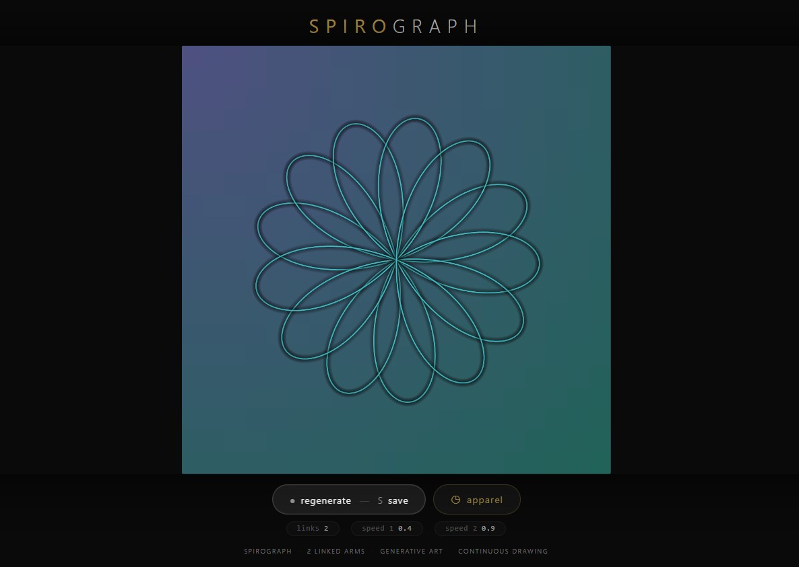
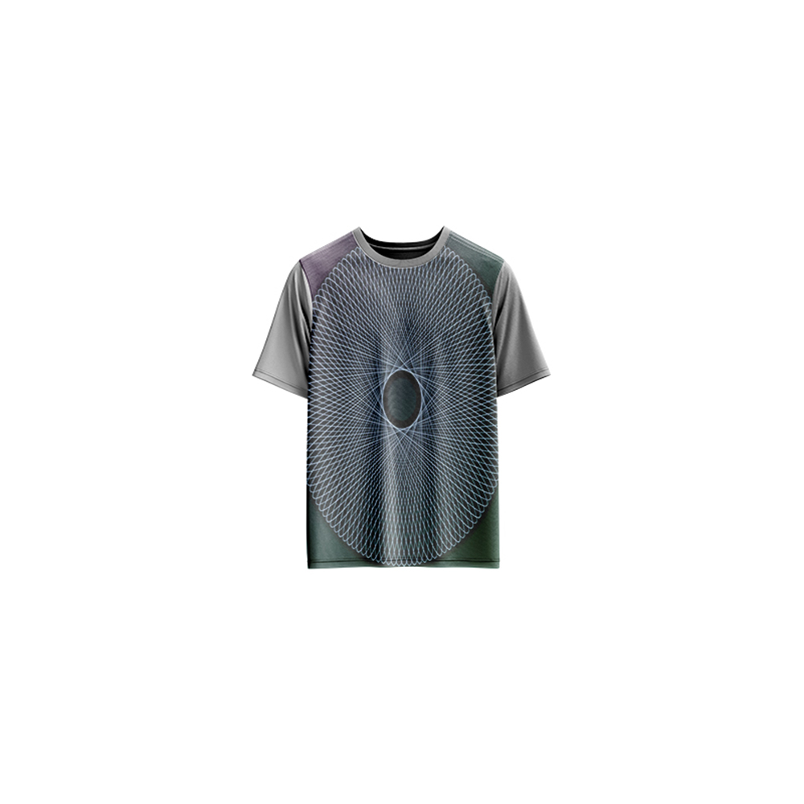

# Spirograph — Generative Art

[](https://reyrove.github.io/Spirograph-Generative-Art)
[](https://opensource.org/licenses/MIT)

> **Generative spirograph art with linked pendulum motion.** Each refresh creates a unique spirograph pattern with 2 linked arms, continuously drawing intricate geometric designs across a gradient background.

## 🎨 Live Demo

<div align="center">
  <a href="https://reyrove.github.io/Spirograph-Generative-Art" target="_blank">
    
  </a>
  <br><br>
  <a href="https://reyrove.github.io/Spirograph-Generative-Art" target="_blank">
    
  </a>
  <br>
  <em>Click the image or button to experience the generative art</em>
</div>

## 👕 Apparel Preview

<div align="center">
  
  <br>
  <em>Spirograph artwork printed on a T-shirt</em>
</div>

## ✨ Features

- **Linked Pendulum Motion** — Two arms creating complex spirograph patterns
- **Continuous Drawing** — Patterns evolve and grow over time
- **Gradient Background** — Two random colors blended diagonally
- **Gradient Stroke** — Colors transition along the drawn path
- **Infinite Variation** — Each refresh creates unique patterns
- **Save & Share** — Download as PNG or GIF
- **Apparel Mode** — Preview artwork on a T-shirt mockup
- **Responsive** — Works on desktop, tablet, and mobile
- **p5.js Powered** — Built with the creative coding library
- **Keyboard Shortcuts**:
  - `R` — Regenerate
  - `S` — Save as PNG
  - `T` — Toggle apparel view
  - `Space` — Regenerate

## 🎨 Artwork Details

| Parameter | Range | Description |
|-----------|-------|-------------|
| **Linked Arms** | 2 | Fixed number of arms |
| **Arm Length** | Variable | Randomly distributed total length |
| **Speed 1** | 0.1–1.0 | First arm rotation speed |
| **Speed 2** | 0.1–1.0 | Second arm rotation speed (unique) |
| **Background Colors** | 2 random | Gradient blend |
| **Foreground Color** | 1 random | Stroke color |

## 🎯 Motion Dynamics

### Two-Arm System
- First arm rotates from center
- Second arm rotates from end of first
- Creates complex interference patterns

### Speed Relationships
- Speeds are random (0.1–1.0)
- Ensured to be different values
- Creates unique pattern geometries

### Continuous Evolution
- Pattern draws continuously
- Never repeats exactly
- Organic, flowing designs

## 🚀 Quick Start

### Local Development

```bash
# Clone the repository
git clone https://github.com/reyrove/Spirograph-Generative-Art.git

# Navigate to the directory
cd Spirograph-Generative-Art

# Open in browser
open index.html
# or use a live server
```

### Deploy to GitHub Pages

1. Push to GitHub
2. Go to Settings → Pages
3. Select branch `main` and root folder
4. Your site will be live at `https://reyrove.github.io/Spirograph-Generative-Art`

## 🧠 How It Works

The artwork generates spirograph patterns using linked pendulum motion:

1. **Setup**:
   - Random background gradient (2 colors)
   - Random foreground color
   - Random arm lengths (sum fixed)
   - Random speeds (0.1–1.0, different values)

2. **Motion**:
   - Arm 1 rotates from center at speed 1
   - Arm 2 rotates from arm 1 end at speed 2
   - Combined motion creates spirograph patterns
   - Continuous rotation draws evolving designs

3. **Rendering**:
   - Path traced by the end of arm 2
   - Gradient stroke from background to foreground
   - Shadow effects for depth
   - Guide lines and pivot points shown

## 📁 File Structure

```
Spirograph-Generative-Art/
├── index.html          # Main application (all-in-one)
├── Spirograph.jpg      # T-shirt mockup image
├── fav.svg             # Favicon
├── demo-screenshot.jpg # Website demo screenshot
├── README.md           # This file
└── LICENSE             # MIT License
```

## 🛠️ Tech Stack

- **p5.js** — Creative coding library
- **Canvas API** — 2D rendering
- **CSS Flexbox/Grid** — Responsive layout
- **GitHub Pages** — Hosting

## 🎯 Interactive Controls

| Action | Keyboard | Button |
|--------|----------|--------|
| Regenerate | `R` or `Space` | Click "regenerate" |
| Save as PNG | `S` | Click "regenerate" |
| Save as GIF | — | Press 'S' key |
| Toggle Apparel | `T` | Click "apparel" |

## 🎨 The Creative Process

### Spirograph Physics
The artwork simulates a classic spirograph using two linked arms. The first arm rotates from the center, and the second arm rotates from the end of the first. The combined motion creates beautiful, intricate patterns that evolve continuously.

### Harmonic Motion
Each arm rotates at a different speed, creating harmonic interference patterns. The ratio of speeds determines the complexity and symmetry of the resulting design.

### Visual Feedback
The drawing process is shown in real-time, with guide lines and pivot points visible. The completed path displays with a gradient stroke that transitions from background to foreground color.

## 📱 Responsive Design

The application automatically adapts to:
- Desktop screens
- Tablets
- Mobile phones
- Landscape orientation
- Various aspect ratios
- Small screens (down to 380px wide)

## 🤝 Contributing

Contributions are welcome! Feel free to:
- Fork the repository
- Create a feature branch
- Submit a pull request

### Ideas for Contributions:
- Additional arm configurations
- New color palettes
- Interactive speed controls
- Performance optimizations
- More apparel mockups

## 📄 License

MIT License — see [LICENSE](LICENSE) file for details.

## 🙏 Acknowledgments

- Created with p5.js
- Inspired by classic spirograph toys
- Special thanks to the creative coding community

---

**Built with ❤️ and spinning dreams**